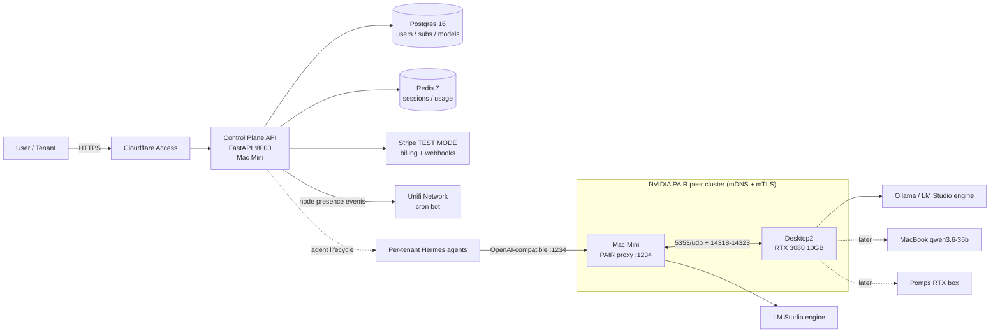

# System Context — cpompa-ai-cloud

## Components

| Component | Host | Purpose |
|---|---|---|
| Control Plane API | Mac Mini | Users, subscriptions, model catalog, agent provisioning |
| Postgres / Redis | Mac Mini (compose) | Persistence + sessions/usage |
| PAIR proxy | Mac Mini `127.0.0.1:1234` | Inference routing — claims LM Studio's port; clients unchanged |
| GPU node | Desktop2 (RTX 3080) | Ollama/LM Studio engines serving models |
| Stripe | SaaS | Test-mode subscriptions + metered usage |
| Unifi bot | Hermes cron | Node presence events feeding node inventory |
